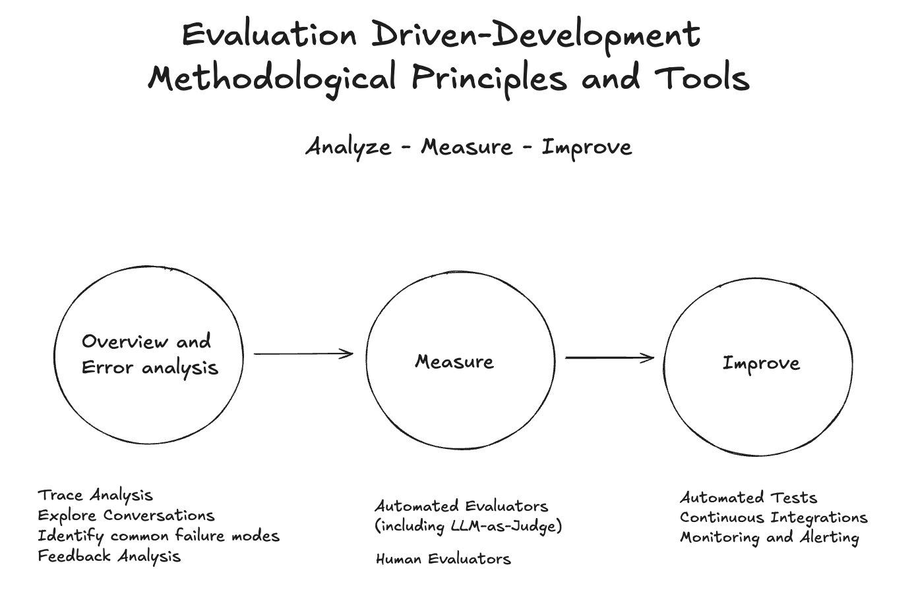
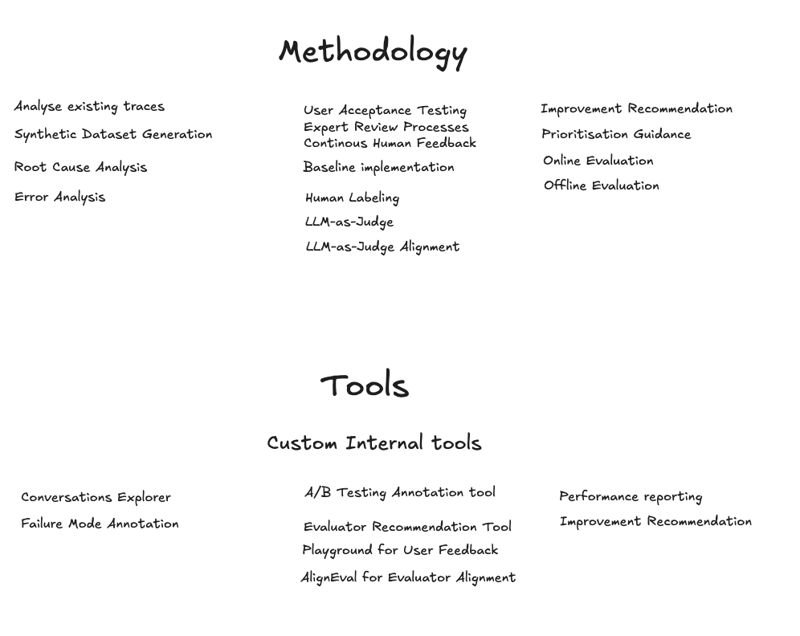
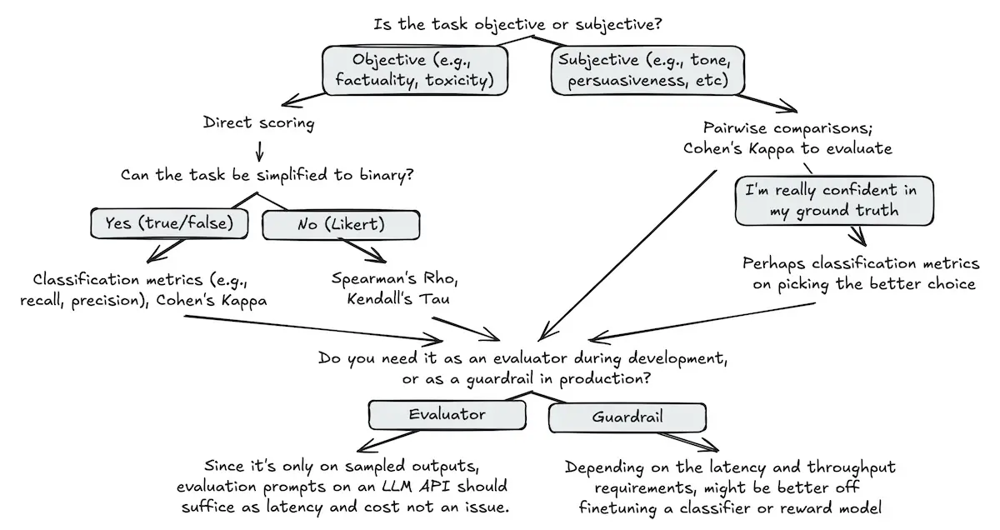

# Analyze-Measure-Improve Lifecycle

The **Analyze-Measure-Improve** lifecycle explains the core principles of the evaluation-driven methodology for AI systems. This approach ensures continuous improvement and robust evaluation by structuring the process into three iterative stages:

---

## 1. Overview and Error Analysis

- **Purpose:** Begin by understanding the current state of your AI system, identifying issues, and analyzing errors.
- **Key Activities:**
  - **Analyze-Measure-Improve Lifecycle:** Establish the cycle as a foundation for ongoing evaluation and enhancement.
  - **Error Analyses:** Systematically investigate failures, misclassifications, or unexpected behaviors to uncover root causes and improvement opportunities.

---

## 2. Measure

- **Purpose:** Quantify system performance and evaluation outcomes using both automated and collaborative methods.
- **Key Activities:**
  - **Implementing Automated Evaluators:** Deploy tools and frameworks for automated assessment, including the use of LLMs as judges for qualitative or complex tasks.
  - **Collaborative Evaluation Practices:** Involve multiple stakeholders (e.g., developers, domain experts, end-users) in the evaluation process to ensure comprehensive and unbiased measurement.

  

---

## 3. Improve

- **Purpose:** Use insights from analysis and measurement to drive continuous system enhancement.
- **Key Activities:**
  - **Continuous Integration and Continuous Deployment/Monitoring:** Integrate improvements into the system and monitor their impact in real time, ensuring that changes lead to measurable gains.
  - **Specific Architectures (e.g., RAG, Agents):** Apply the lifecycle to specialized AI architectures, such as Retrieval-Augmented Generation (RAG) and agent-based systems, adapting evaluation and improvement strategies as needed.

---

## How This Fits Into Evaluation-Driven Methodology

The Analyze-Measure-Improve lifecycle is central to evaluation-driven development. By iteratively analyzing errors, measuring performance, and implementing improvements, teams can:
- Ensure that AI systems evolve in response to real-world feedback and data
- Maintain high standards of quality, reliability, and user satisfaction
- Foster a culture of continuous learning and adaptation

This structured approach is applicable across a wide range of AI projects, from LLM-powered applications to complex agent-based systems. 