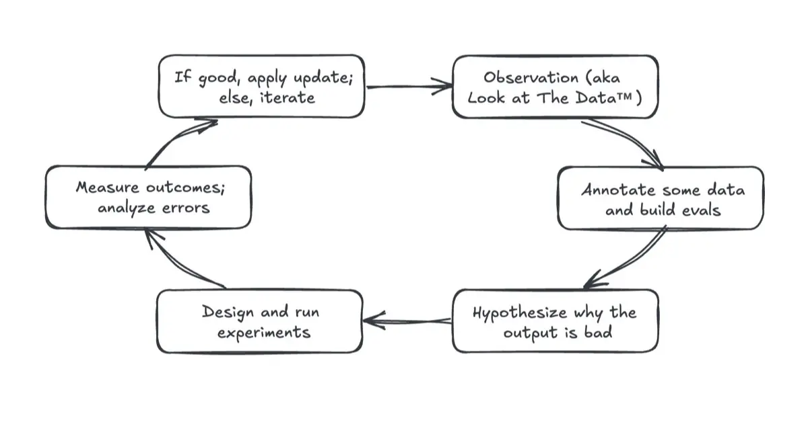
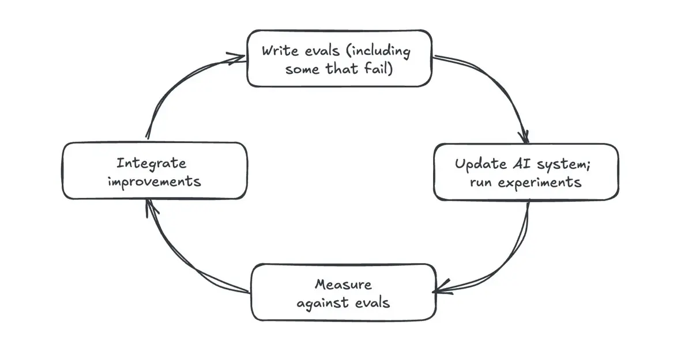

# Core Principles of AI Evaluation

The foundation of Faktion's approach to generative AI evaluation rests on four fundamental principles that guide every evaluation decision we make. These principles ensure consistency, quality, and effectiveness across all our AI projects.

The entire toolkit of best practices is base on the scientific method and this is how we see it applied in the context of AI evaluation.

## The Four Pillars

### 1. Comprehensive Assessment

**"Evaluate all dimensions of AI system performance"**

AI systems are complex, multi-faceted technologies that require evaluation across multiple dimensions. We don't just measure accuracy—we assess the complete user experience and business impact.

**Key Dimensions:**

- **Functional Performance**: Does the system do what it's supposed to do?
- **Quality Metrics**: How well does it perform its intended function?
- **User Experience**: Is the system usable and valuable to end users?
- **Business Impact**: Does it contribute to organizational objectives?
- **Ethical Considerations**: Are there bias, fairness, or safety concerns?
- **Technical Performance**: Is the system efficient, scalable, and maintainable?

### 2. Context-Driven Evaluation

**"One size does not fit all"**

Evaluation strategies must be tailored to the specific context, use case, and stakeholder needs. What matters for a customer service chatbot differs significantly from what matters for a code generation assistant.

**Context Factors:**

- **Domain Requirements**: Industry-specific quality standards
- **User Demographics**: Different users, different needs
- **Risk Tolerance**: High-stakes vs. low-stakes applications
- **Resource Constraints**: Available time, budget, and expertise
- **Regulatory Environment**: Compliance and legal requirements

### 3. Continuous Improvement
**"Evaluation is not a one-time event"**

AI systems operate in dynamic environments where data, user needs, and business requirements constantly evolve. Our evaluation processes must be continuous and adaptive.

**Continuous Elements:**

- **Real-time Monitoring**: Ongoing performance tracking
- **Feedback Integration**: Incorporating user and stakeholder input
- **Performance Drift Detection**: Identifying degradation over time
- **Iterative Refinement**: Regular model and system improvements
- **Learning from Failures**: Systematic analysis of issues and errors

### 4. Evidence-Based Decision Making
**"Data beats opinions"**

Every evaluation decision should be grounded in empirical evidence. We collect, analyze, and act on data rather than relying on intuition or assumptions.

**Evidence Types:**

- **Quantitative Metrics**: Numerical performance measurements
- **Qualitative Insights**: User feedback and expert observations
- **Comparative Analysis**: Performance relative to baselines and alternatives
- **Statistical Significance**: Rigorous analysis of performance differences
- **Longitudinal Trends**: Performance patterns over time

---

*These principles represent the distilled wisdom of our collective experience in AI evaluation. They provide the foundation for all our evaluation work while remaining flexible enough to adapt to new challenges and opportunities.*